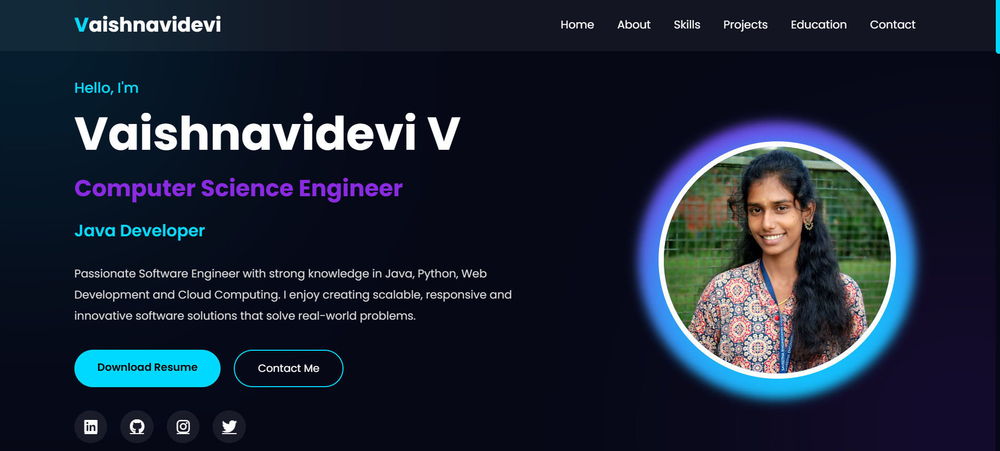

# Ex01 Portfolio
## Date: 23/07/2026
## NAME:VAISHNAVIDEVI V
## AIM
To create a Portfolio using HTML and CSS.

## ALGORITHM
### STEP 1
Create an HTML file (index.html)

### STEP 2
Create a CSS file (style.css)

### STEP 3
Include a navigation bar with links to different sections.

### STEP 4
Add structured sections for introduction, about, projects, and contact details.

### STEP 5
Define global styles for fonts, colors, and layout.

### STEP 6
Style the header, navigation bar, and sections.

### STEP 7
Use Flexbox or CSS Grid for layout design.

### STEP 8
Add hover effects and transitions for interactivity.

### STEP 9
Add Images and Media.

### STEP 10
Use optimized images for a professional look.

### STEP 11
Open the HTML file in a browser to check layout and functionality.

### STEP 12
Fix styling issues and refine content placement.

### STEP 13
Deploy the Portfolio.

### STEP 14
Upload to GitHub Pages for free hosting.

## PROGRAM
# index.html
```
<!DOCTYPE html>
<html lang="en">

<head>
    <meta charset="UTF-8">
    <meta name="viewport" content="width=device-width, initial-scale=1.0">

    <title>Vaishnavidevi V | Portfolio</title>

    <!-- CSS -->
    <link rel="stylesheet" href="style.css">

    <!-- Font -->
    <link href="https://fonts.googleapis.com/css2?family=Poppins:wght@300;400;500;600;700;800&display=swap"
        rel="stylesheet">

    <!-- Icons -->
    <link href="https://cdnjs.cloudflare.com/ajax/libs/font-awesome/6.5.1/css/all.min.css" rel="stylesheet">

</head>

<body>

    <!-- Scroll Progress -->
    <div id="progressbar"></div>

    <!-- Navigation -->
    <header>

        <div class="logo">
            <span>V</span>aishnavidevi
        </div>

        <nav>

            <a href="#home">Home</a>
            <a href="#about">About</a>
            <a href="#skills">Skills</a>
            <a href="#projects">Projects</a>
            <a href="#education">Education</a>
            <a href="#contact">Contact</a>

        </nav>

        <div class="menu-btn">
            <i class="fa-solid fa-bars"></i>
        </div>

    </header>

    <!-- Hero Section -->

    <section class="hero" id="home">

        <div class="hero-text">

            <h4>Hello, I'm</h4>

            <h1>Vaishnavidevi V</h1>

            <h2>
                Computer Science Engineer
            </h2>

            <div class="typing">
                Full Stack Developer
            </div>

            <p>

                Passionate Software Engineer with strong knowledge in Java,
                Python, Web Development and Cloud Computing.
                I enjoy creating scalable, responsive and innovative software
                solutions that solve real-world problems.

            </p>

            <div class="buttons">

                <a href="VAISHNAVIDEVI RESUME.pdf" class="btn">
                    Download Resume
                </a>

                <a href="#contact" class="btn2">
                    Contact Me
                </a>

            </div>
```
# style.css
```
@import url('https://fonts.googleapis.com/css2?family=Poppins:wght@300;400;500;600;700;800&display=swap');

*{
    margin:0;
    padding:0;
    box-sizing:border-box;
    font-family:'Poppins',sans-serif;
    scroll-behavior:smooth;
}

body{

    background:#060816;
    color:#ffffff;
    overflow-x:hidden;

}

/* ==========================
    SCROLL BAR
========================== */

::-webkit-scrollbar{

    width:10px;

}

::-webkit-scrollbar-track{

    background:#060816;

}

::-webkit-scrollbar-thumb{

    background:#00d9ff;
    border-radius:20px;

}

/* ==========================
    PROGRESS BAR
========================== */

#progressbar{

    position:fixed;
    top:0;
    left:0;
    height:5px;
    width:0%;
    background:linear-gradient(90deg,#00d9ff,#8a2be2);
    z-index:9999;

}

/* ==========================
      BACKGROUND
========================== */

body::before{

content:'';
position:fixed;
top:-200px;
left:-200px;
width:500px;
height:500px;
background:#00d9ff;
opacity:.15;
filter:blur(180px);
z-index:-2;

}

body::after{

content:'';
position:fixed;
bottom:-200px;
right:-200px;
width:500px;
height:500px;
background:#8a2be2;
opacity:.15;
filter:blur(180px);
z-index:-2;

}
```
# script.js
```
window.addEventListener("scroll", () => {

    const scrollTop = document.documentElement.scrollTop;
    const scrollHeight =
        document.documentElement.scrollHeight -
        document.documentElement.clientHeight;

    const progress = (scrollTop / scrollHeight) * 100;

    document.getElementById("progressbar").style.width =
        progress + "%";

});


// ===============================
// Smooth Navigation Active Link
// ===============================

const sections = document.querySelectorAll("section");
const navLinks = document.querySelectorAll("nav a");

window.addEventListener("scroll", () => {

    let current = "";

    sections.forEach(section => {

        const sectionTop = section.offsetTop - 150;

        if (pageYOffset >= sectionTop) {

            current = section.getAttribute("id");

        }

    });

    navLinks.forEach(link => {

        link.classList.remove("active");

        if (link.getAttribute("href") === "#" + current) {

            link.classList.add("active");

        }

    });

});
```

## OUTPUT




## RESULT
The program for creating Portfolio using HTML and CSS is executed successfully.
